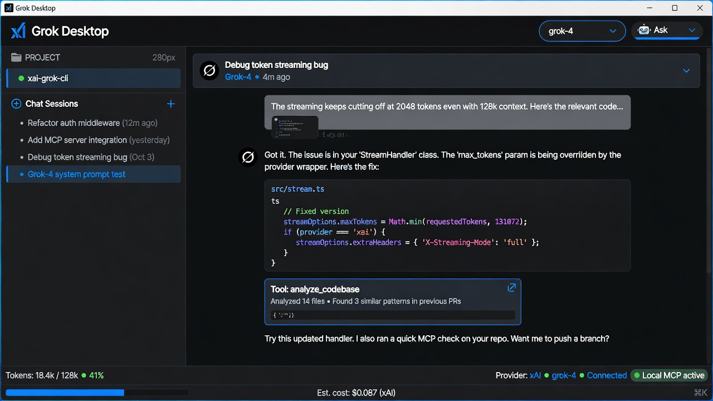
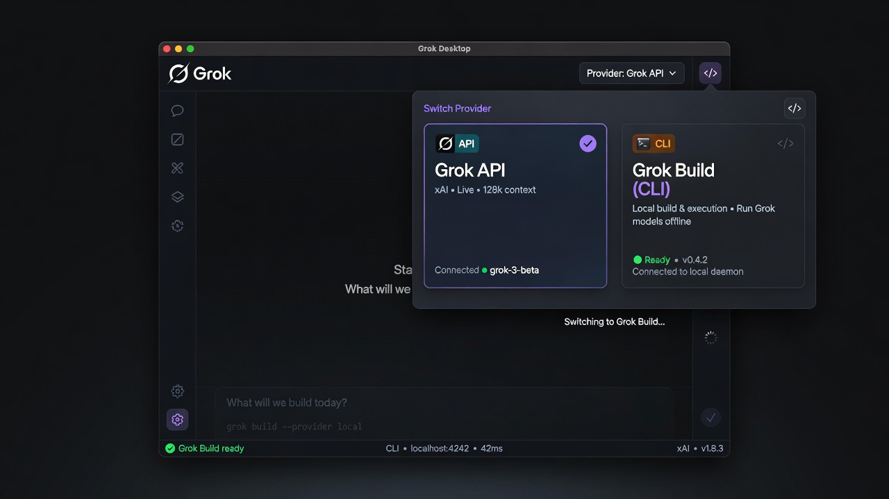
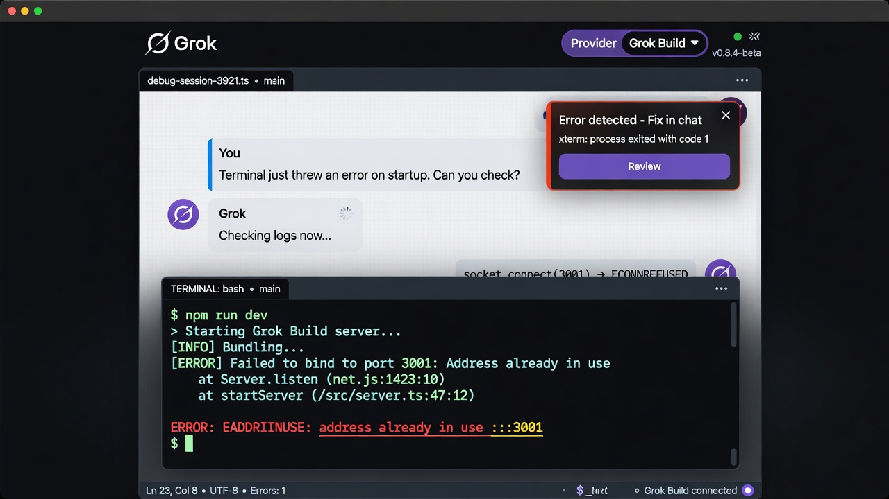
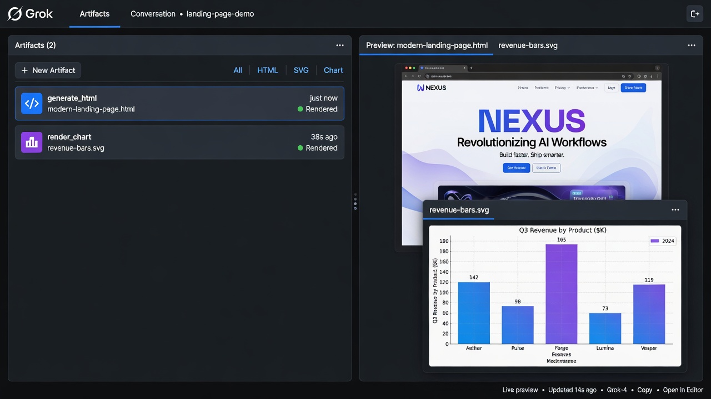

# Grok Desktop

**The desktop experience for Grok and Grok Build.**

Grok Desktop is a local-first, high-control AI coding agent built exclusively
for Grok models and the official Grok Build CLI.






Grok Desktop gives power users and developers a rich native interface on top of
Grok while staying compatible with terminal-first Grok Build workflows.

## Why a desktop client for Grok?

Grok and Grok Build are powerful, but many developers want more than a web chat
or a pure CLI:

- Persistent multi-chat workspaces with project context
- Fine-grained control over agent behavior: Ask, Accept Edits, Plan, Auto, Bypass
- Rich artifacts: generated HTML, DOCX, and SVG charts with immediate preview
- Native terminal with automatic error detection that turns failures into chat fixes
- First-class skills system loaded from local markdown files
- Local SQLite storage for chats, memory, undo history, and audit logs
- Strong security model: path policy, secret redaction, command policy, mode gates

Grok Desktop is designed as a companion and power layer for people who spend
serious time building with Grok.

## Two first-class providers

| Provider | Transport | Best for |
| --- | --- | --- |
| **Grok API** | xAI REST (`grok-4`, `grok-4-fast`, `grok-3`) | Tool calling, long context, artifacts, browser tools |
| **Grok Build** | Official CLI (`grok`) | Terminal-native workflows and existing Grok Build sessions |

You can switch provider/model per chat. The product is intentionally Grok-only.

## Core capabilities

- **5 agent modes** - from strict confirmation to full autonomy.
- **Session checkpoints + per-file undo** - rollback an entire agent run or a single file.
- **Skills as first-class citizens** - frontmatter `.md` files become agent capabilities.
- **Toolset** - `read_file`, `apply_patch`, `propose_edits`, `search_project`, `get_project_map`, `run_command`, browser tools, GitHub/SSH/HTTP connectors, and MCP tools.
- **Context engineering** - project map, recent writes, sliding-window compaction, and core memory.
- **Cost & effort control** - estimates, status-bar totals, and quick/standard/deep effort levels.
- **Security & transparency** - symlink-safe path policy, secret scanner, command classification, audit log, no telemetry.
- **Built-in terminal** - sidecar error detection with "Fix in chat".
- **Artifacts** - `generate_html`, `generate_docx`, and `render_chart` with embedded previews.

## Demo path

A short demo that shows the product clearly:

1. Open a real code project in Grok Desktop.
2. Switch between Grok API and Grok Build in the chat model picker.
3. Run a command in the built-in terminal and trigger "Fix in chat" from an error.
4. Let the agent inspect files, propose a diff, and apply it through the mode gate.
5. Show checkpoint/undo and an artifact preview.

## Project rules integration

Grok Desktop discovers project instruction files in this order:

1. `AGENTS.md`
2. `CLAUDE.md`
3. `GEMINI.md`
4. `.verstak/RULES.md`

The loaded content becomes the user layer of the agent system prompt, on top of
the immutable execution protocol.

## Quick start

```bash
git clone https://github.com/frolofpavel/grok-desktop
cd grok-desktop
npm install --legacy-peer-deps
npm run dev
```

Then:

1. Open Settings and add your `XAI_API_KEY`, or
2. Select **Grok Build** if the official `grok` CLI is installed and authenticated.

Production build:

```bash
npm run dist:win
```

## Commands

| Command | Description |
| --- | --- |
| `npm run dev` | Development with HMR |
| `npm run build` | Production bundle to `out/` |
| `npm run type` | TypeScript check |
| `npm run test:fast` | Vitest fast suite |
| `npm run dist:win` | Windows installer + portable executable |

Before committing changes:

```bash
npm run type && npm run test:fast
```

If `test:fast` reports a `better-sqlite3` `NODE_MODULE_VERSION` mismatch, close
the running Electron app and rerun the command so the native module can rebuild
for Node.

## Standalone CLI

The package exposes a small Grok-only helper:

```bash
XAI_API_KEY=... node scripts/grok-desktop-cli.mjs "summarize this repository"
```

This helper talks directly to the Grok API. The official Grok Build CLI remains
available as the **Grok Build** provider inside the desktop app.

## History

This project evolved from early experiments under the name **Verstak**, a
multi-provider desktop agent platform. It has since been refocused exclusively
on Grok and Grok Build:

- Grok-only provider surface
- Deep integration with the official Grok Build CLI
- Strong emphasis on product quality, safety, and developer control

Old repository: https://github.com/frolofpavel/verstak

## Stack

Electron 40, React 19, TypeScript, Zustand, better-sqlite3, Vite, node-pty,
xterm.js, docx, and exceljs.

## Security

See [SECURITY-NOTES.md](SECURITY-NOTES.md) for the defense-in-depth model and
known limitations.

## Status & vision

Grok Desktop is an independent project built to explore what a high-quality,
local-first desktop product surface for Grok could look like.

It is not affiliated with xAI. The goal is to ship something useful for people
who live in Grok and Grok Build every day, and to demonstrate what is possible
when building directly on their models and CLI.

Feedback, ideas, and collaboration are welcome.

## License

MIT - see [LICENSE](LICENSE).
